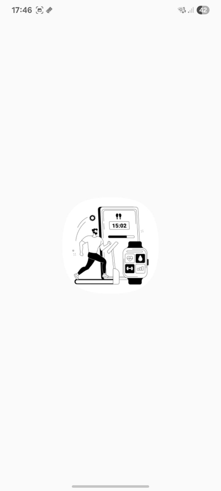

<h1 align="center">📱 LifeOS - Habit Tracker App</h1>

  

<h3 align="center">✨ Build Better Habits. Boost Your Productivity. ✨</h3>

---

<h2>🚀 About the Project</h2>

<b>LifeOS</b> is a habit tracking app built using <b>Kotlin Jetpack Compose</b> for the frontend and <b>Node.js + Express + MongoDB</b> for the backend.  
This project is my personal journey to understand how <b>frontend</b> and <b>backend</b> interact in real-world apps.  

<ul>
  <li>📌 <b>Frontend:</b> Kotlin Jetpack Compose (Modern Android UI)</li>
  <li>📌 <b>Backend:</b> Node.js + Express + MongoDB</li>
  <li>📌 <b>Auth:</b> Email-based authentication with <b>hashed passwords</b> & token verification</li>
  <li>📌 <b>Status:</b> MVP (More features coming soon!)</li>
</ul>

---

<h2>🔑 Features</h2>

<ul>
  <li>✅ Track your daily habits & boost productivity</li>
  <li>✅ User authentication with secure hashed passwords</li>
  <li>✅ Email verification using tokens</li>
  <li>✅ MongoDB database for storing user data</li>
  <li>✅ Built entirely with Jetpack Compose</li>
</ul>

---

<h2>🖼️ App Screenshots</h2>

  
  
  

  
<!--   
   -->

---

<h2>📥 Download</h2>

  👉 <a href="https://drive.google.com/file/d/1EdEUyeJRN2a1vAEJBmkZc6bvXCE3-9CY/view?usp=sharing" target="_blank"><b>Download APK from Google Drive</b></a> 👈

---

<h2>🛠️ Tech Stack</h2>

<ul>
  <li><b>Frontend:</b> Kotlin, Jetpack Compose</li>
  <li><b>Backend:</b> Node.js, Express.js</li>
  <li><b>Database:</b> MongoDB</li>
  <li><b>Auth:</b> JWT, Password Hashing</li>
</ul>

---

<h2>📌 Future Enhancements</h2>

<ul>
  <li>🔜 Analytics & habit streak tracking</li>
  <li>🔜 Notifications & reminders</li>
  <li>🔜 Cloud sync support</li>
</ul>

---

<h2>📧 Contact</h2>

If you have suggestions or want to contribute, feel free to reach out!  

  Made with ❤️ while learning Backend & Jetpack Compose

